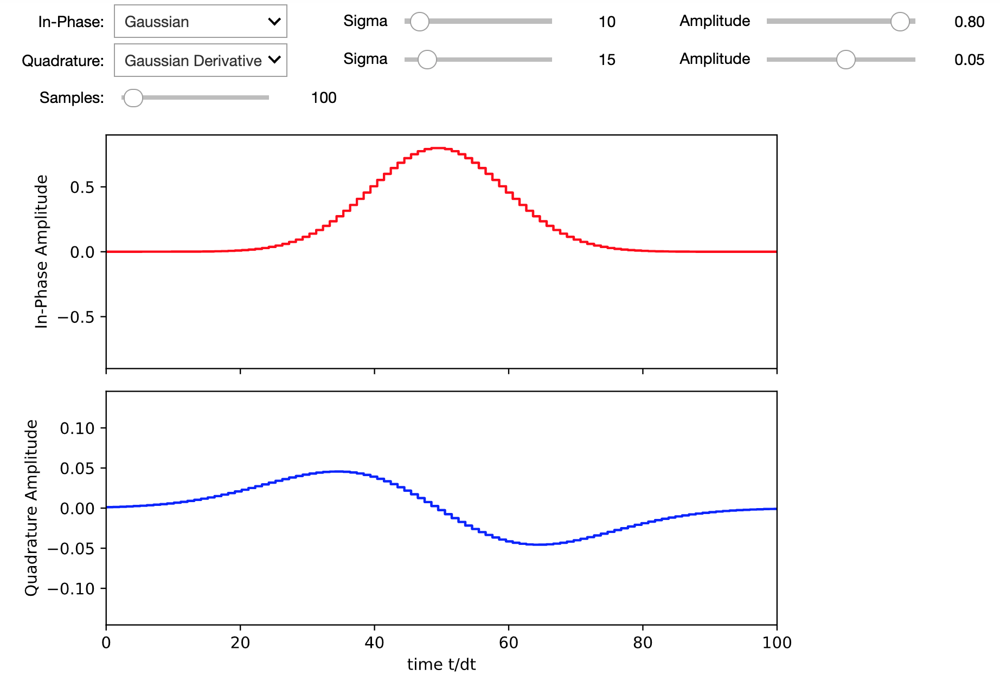
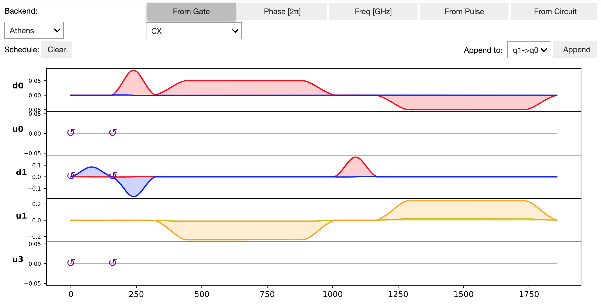

# Pulsemaker
[](https://pypi.org/project/pulsemaker/)

Pulsemaker is a Python widget library for designing pulses and pulse schedules for quantum computing hardware. The library can be used in Jupyter notebooks, JupyterLab, and the IPython kernel.

Currently, the export feature only supports IBM's [Qiskit Pulse](https://qiskit.org/documentation/apidoc/pulse.html), but Rigetti's [Quil-T](https://pyquil-docs.rigetti.com/en/stable/quilt.html) and Pasqal's [Pulser](https://github.com/pasqal-io/Pulser) can be considered if there is enough interest.

To see a workflow that combines both the `PulseDesigner` and the `ScheduleDesigner` into a single dashboard, check out [qonduit](https://github.com/adgt/qonduit).

## Pulse Designer

## Schedule Designer


## Getting Started
### Installation

To install use pip (JupyterLab 3 recommended):

    $ pip install pulsemaker

For a development installation,

    $ git clone https://github.com/adgt/pulsemaker.git
    $ cd pulsemaker
    $ pip install -e .

### Tutorials

For a tutorial on how to use the `PulseDesigner` take a look at [Tutorial_PulseDesigner.ipynb](https://nbviewer.jupyter.org/github/adgt/pulseMaker/blob/main/Tutorial_PulseDesigner.ipynb).

For a tutorial on how to use the `ScheduleDesigner` take a look at [Tutorial_ScheduleDesigner.ipynb](https://nbviewer.jupyter.org/github/adgt/pulseMaker/blob/main/Tutorial_ScheduleDesigner.ipynb)

Otherwise, you can simply run:
```python
from pulsemaker import PulseDesigner, ScheduleDesigner
pulse_d = PulseDesigner()
schedule_d = ScheduleDesigner()
display(pulse_d)
display(schedule_d)
```

### API

PulseDesigner()
- `pulse`: waveform data for use in Qiskit

ScheduleDesigner()
- `pulses`: dictionary of pulses in the schedule
- `phases`: dictionary of phases in the schedule
- `freqs`: dictionary of frequencies in the schedule
- `schedule`: schedule in Qiskit format
- `circuit_qasm`: setter for converting qasm to a pulse schedule (write-only)

## Development

Follow the instructions above for a development installation. Then, to actively developing on your machine, run Jupyter Lab with the command:

    $ jupyter lab

Library files are located under the [pulsemaker](pulsemaker) folder. If you are doing work in JupyterLab or notebooks, then it is recommended to use the following for auto-reloading changes to the Python files:

```
%load_ext autoreload
%autoreload 2
```